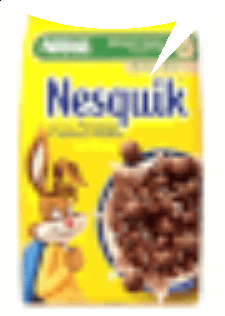
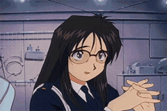

<h1>uhh, heya? — welcome to my github page</h1>
<h3>im just a programmer who makes sounds... or a musician who writes code?</h3>

---

### what i do:

### 🎹 **9 years** making music

### ⌨️ **4 years** programming

---

### language that i use or know:

### shader stuff i know:

### i build stuff with:

### where code happens?

### where music happens?

---

### my stats

#### stinky

---

<i>"nesquik."</i>

---

### that's all for now. thanks for scrolling.

bleh

