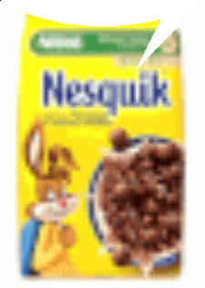
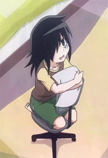

<h1>uhh, heya? — welcome to my github page</h1>
<h3>im just a programmer who makes sounds... or a musician who writes code?</h3>

---

### what i do:

### 🎹 **9 years** making music (3/29/2016)

### ⌨️ **4 years** programming (10/7/2021)

---

*kinda stinky below*

### languages or lang stuff that i use or know:

#### planned to learn:

uhh...

### shader stuff i know:

#### planned to learn:

*uh Direct3D maybe...*

### i build or make stuff with:

### where code happens?

### where music happens?

### OS i use or used (yea):

*btw i **dont** use arch*

---

### my stats

#### stinky

##### heh

---

<i>"nesquik."</i>

---

### that's all for now. thanks for scrolling.
#### now you can check my social medias (if you want)

look! cool tomoko

watamote!!!

larpin larp❤️

