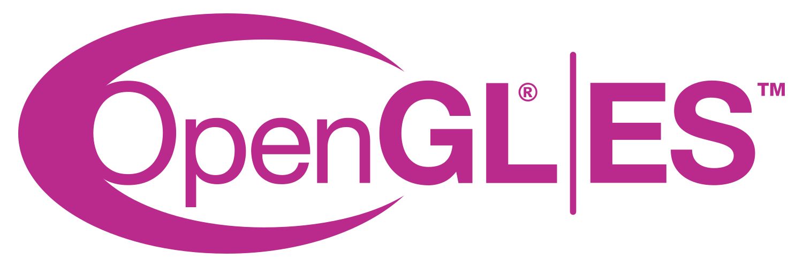
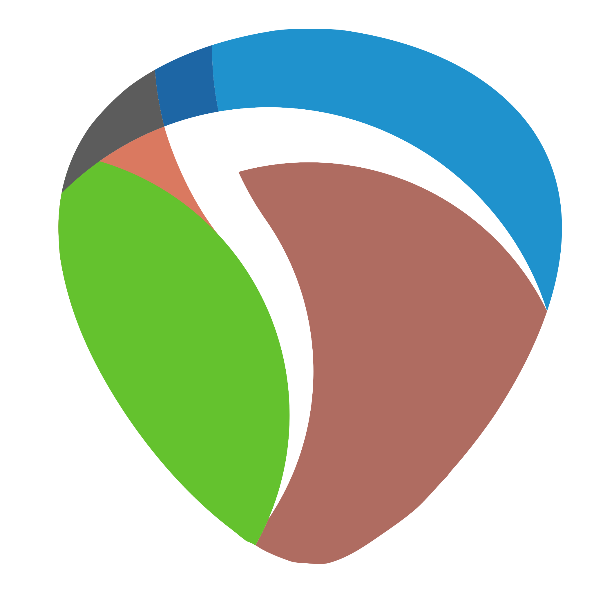
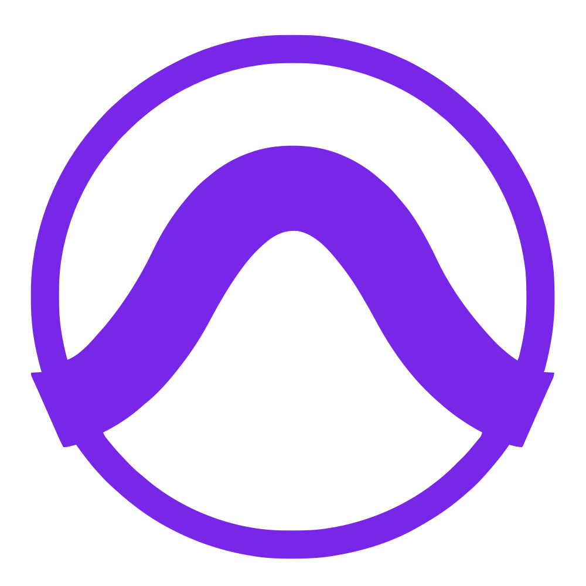
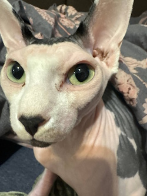
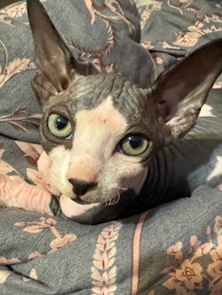

# welcome to my github profile

how did you find me?

### im Daniil Shanin - `dtwotwo`

`making music since 3/29/2016 - 10 years` · `programming since 30/8/2020 - 6 years`

*kinda stinky below, click for details!*

---

<h4>languages or lang stuff that i use / know</h4>

 

 

 

 

stuff planned for learn

---

<h4>making "shader" / "render" stuff with</h4>

 

&nbsp;&nbsp;

&nbsp;&nbsp;

&nbsp;&nbsp;

 

*uh [Direct3D](https://learn.microsoft.com/en-us/windows/win32/direct3d) maybe...*

---

<h4>i build / break stuff with</h4>

 

 

---

<h4>where code happens?</h4>

 

##### right here

---

<h4>where music happens?</h4>

 

&nbsp;

&nbsp;

&nbsp;

&nbsp;

&nbsp;

&nbsp;

##### right here

---

<h4>os i have willingly interacted with</h4>

 

 

windows · arch btw · macos

---

<h4>some github numbers</h4>

 

<picture>
	<source
		media="(prefers-color-scheme: dark)"
		srcset="https://github-readme-stats-seven-nu-92.vercel.app/api?username=dtwotwo&show_icons=true&theme=tokyonight&text_bold=true&hide_border=true&rank_icon=github"
	/>
	<source
		media="(prefers-color-scheme: light)"
		srcset="https://github-readme-stats-seven-nu-92.vercel.app/api?username=dtwotwo&show_icons=true&theme=default&text_bold=true&hide_border=true&rank_icon=github"
	/>
	
</picture>

<picture>
	<source
		media="(prefers-color-scheme: dark)"
		srcset="https://github-readme-stats-seven-nu-92.vercel.app/api/top-langs/?username=dtwotwo&theme=tokyonight&text_bold=true&layout=compact&langs_count=8&hide_border=true"
	/>
	<source
		media="(prefers-color-scheme: light)"
		srcset="https://github-readme-stats-seven-nu-92.vercel.app/api/top-langs/?username=dtwotwo&theme=default&text_bold=true&layout=compact&langs_count=8&hide_border=true"
	/>
	
</picture>

 

<picture>
	<source
		media="(prefers-color-scheme: dark)"
		srcset="https://streak-stats.demolab.com?user=dtwotwo&theme=tokyonight&hide_border=true"
	/>
	<source
		media="(prefers-color-scheme: light)"
		srcset="https://streak-stats.demolab.com?user=dtwotwo&theme=default&hide_border=true"
	/>
	
</picture>

##### stinky

---

<h4>ohh my cats</h4>

 

<table>
<tr>
<td align="center">

 
<b>Kot</b>
</td>
<td align="center">

 
<b>Lucik</b>
</td>
</tr>
</table>

---

##### heh

